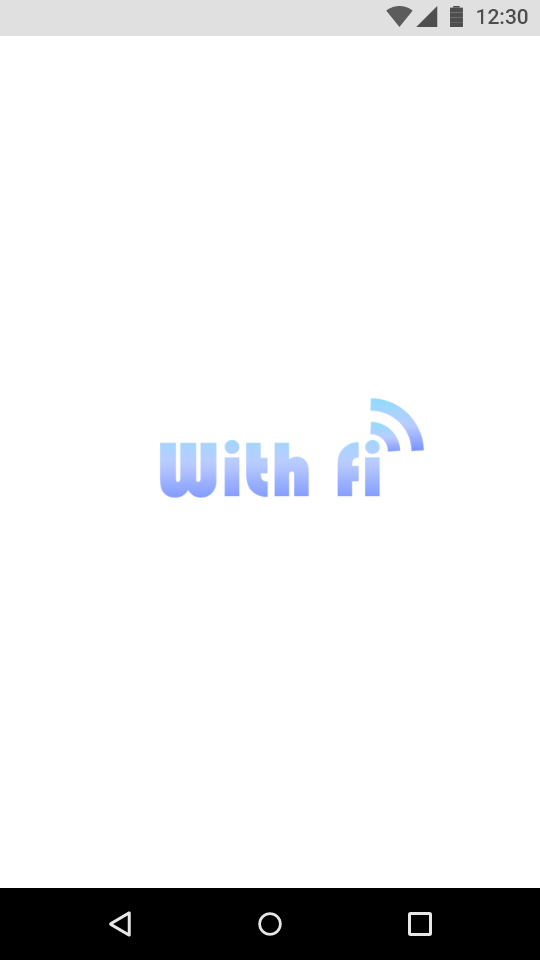
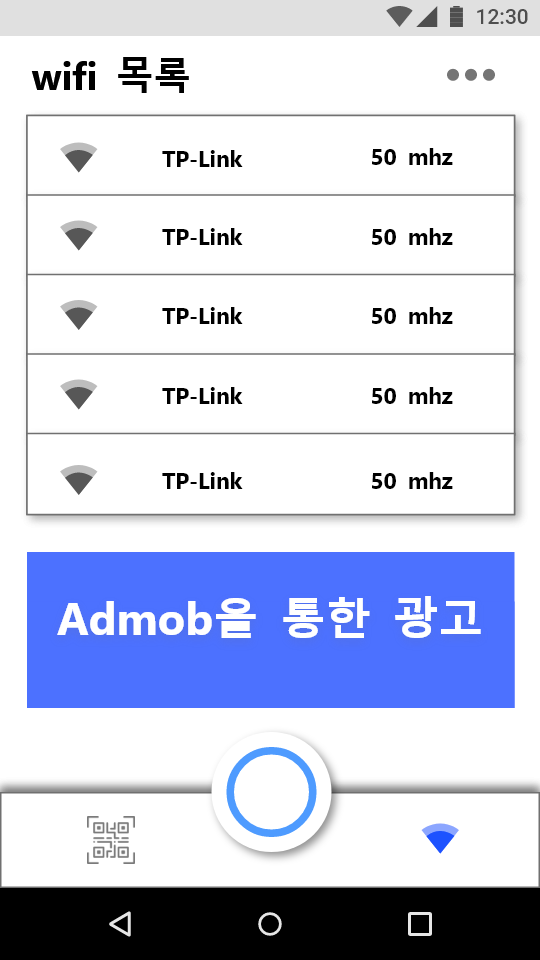
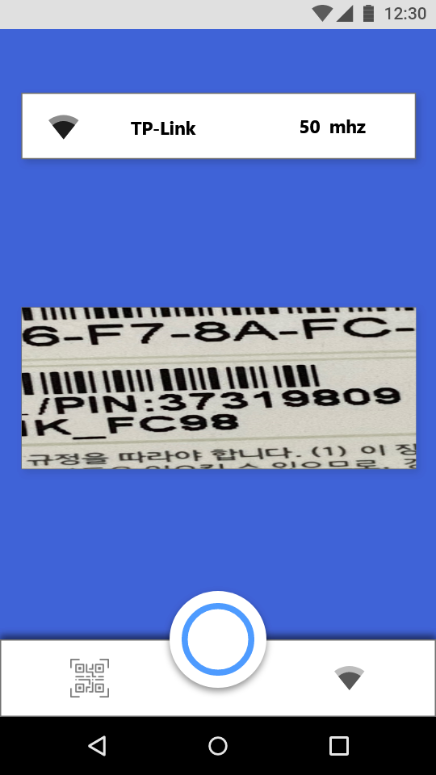
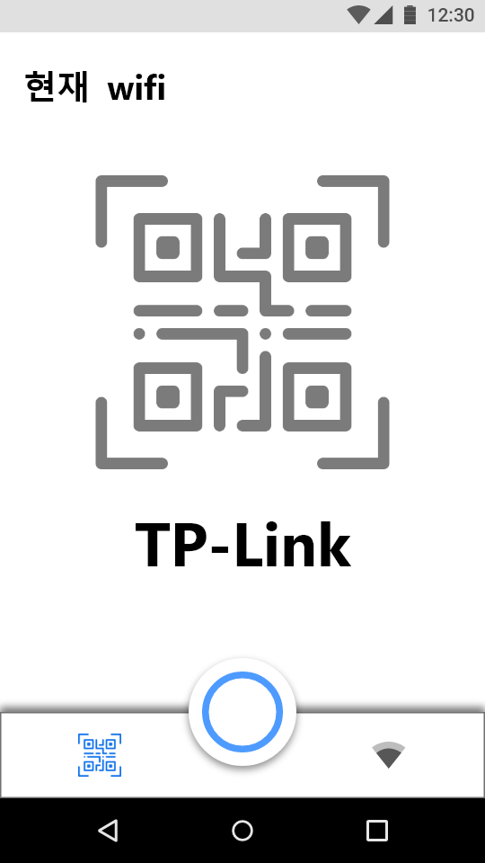

# wifi-solution

평소에 wifi 접속을 할 때, 일일이 텍스트로 비밀번호를 입력해야하는 불편한 점과 친구들과 wifi를 보다 쉽게 사용하고 공유하는 목적으로 **With fi**라는 앱을 기획하게 되었습니다.

 

전체적인 **기능**은 다음과 같습니다.

- OCR 기술을 활용한 wifi 자동 접속 기능.
- wifi 속도 비교 기능.
- QR 코드 생성을 통해, 주변 사람들이 빠르게 wifi를 접속할 수 있게끔 도와주는 기능.

## 레이아웃

layout은 **Intro, wifi_now, OCR_scan, QR_wifi** 등 크게 4개의 화면으로 구성했으며, 전체적인 layout 구성은 다음 링크에서 볼 수 있습니다. 

(https://xd.adobe.com/view/2c83916c-5427-405c-8cf7-54b5c5392961-79d0/grid/) 

< br>

### Intro

Intro layout은 처음 접속했을 때, 2초간 보여주도록 할 것입니다.

### wifi_now

wifi_now는 현재 주변에 있는 wifi 목록과 인터넷 속도를 보여줍니다.

### OCR_scan

OCR_scan 화면은 적혀있는 wifi의 비밀번호를 스캔해 바로 접속하는 기능을 가지고 있습니다.

- 비밀번호가 잘 스캔되지 않는 경우, 형광펜과 같이 사용자가 직접 텍스트 부분을 칠해서 인식할 수 있습니다.
- 또한, 직접 텍스트로 입력해서 연결할 수도 있습니다.
- 연결이 완료되었을 경우 위의 TP-Link 와이파이와 같이 접속이 완료되었다는 표시를 보여줍니다.

### QR_wifi

QR_wifi는 안드로이드 스튜디오의 zxing라이브러리를 사용해, 연결된 와이파이의 ID와 password 정보를 담아 주변 사람들이 이를 스캔만하여도 연결이 가능하게 구현할 예정입니다.

- zxing 라이브러리
- wifi의 ID, Password 정보를 담고 있음.

 

 

## 설계